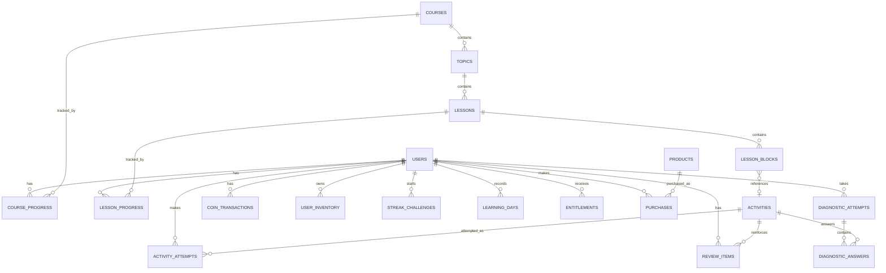

# Data model — MVP

This document is the source of truth for the **conceptual data model** of the La Teacher Alma MVP. It is intended for product/technical planning and for future implementation with PostgreSQL.

It deliberately models the **domain**, not individual screens. UI states such as `Home.ACTIVE`, `Result.PERFECT` or a paywall variant should generally be derived from the domain data described here rather than persisted as screen-specific state.

## Core relationships



Important correction versus the early visual sketch: `course_progress` and `lesson_progress` are **not** modeled as a direct many-to-many relationship. They are independently associated with the user and their respective course/lesson.

## Users

### `users`

Represents the application account/profile identity.

Conceptual fields:

- `id`
- `email`
- `display_name`
- `avatar_url` (optional/future)
- `created_at`
- `updated_at`

Do **not** use `users.is_premium`, `users.current_course` or `users.home_state` as the primary source of truth. Premium/access, active learning and Home state should be derived from related records.

## Educational content

### `courses`

Represents a complete English course/level.

Conceptual fields:

- `id`
- `title`
- `slug`
- `level` (`A1`, `A2`, `B1`, etc.)
- `description`
- `cover_url`
- `status` (`DRAFT`, `PUBLISHED`, `COMING_SOON`)
- `position`
- timestamps

A course may contain both free and paid lessons. Do not collapse course publication/progress state with commercial access.

### `topics`

Logical grouping inside a course.

Conceptual fields:

- `id`
- `course_id`
- `title`
- `description` (optional)
- `position`
- timestamps

Relationship: `Course 1 -> N Topic`.

### `lessons`

Learning unit inside a topic.

Conceptual fields:

- `id`
- `topic_id`
- `title`
- `description` (optional)
- `position`
- `is_required`
- `access_type` (`FREE`, `PAID`)
- `status`
- timestamps

`PAID` means the learner requires valid access, not necessarily a subscription. A paid lesson can be unlocked either by an active membership or by permanent ownership of its course.

### `lesson_blocks`

Ordered reusable content units inside a lesson.

Conceptual fields:

- `id`
- `lesson_id`
- `type`
- `position`
- `required`
- `content` (`JSONB`)
- `activity_id` (nullable; used when `type = ACTIVITY`)
- timestamps

Initial block types:

- `TEXT`
- `VIDEO`
- `IMAGE`
- `EXAMPLE`
- `ACTIVITY`
- `SUMMARY`

`JSONB` is appropriate for type-specific block configuration so the MVP does not need one relational table for every content-block subtype.

## Activities and attempts

### `activities`

Reusable exercise definition.

Conceptual fields:

- `id`
- `type`
- `prompt`
- `config` (`JSONB`)
- `explanation` (optional)
- timestamps

Initial types:

- `MULTIPLE_CHOICE`
- `FILL_BLANK_OPTIONS`
- `FILL_BLANK_TEXT`
- `MATCH_WORD_IMAGE`

The configuration can contain choices, accepted answers, matching pairs and other type-specific data.

### `activity_attempts`

Stores a learner submission regardless of where the activity was presented.

Conceptual fields:

- `id`
- `user_id`
- `activity_id`
- `lesson_id` (nullable)
- `context`
- `answer_data` (`JSONB`)
- `is_correct`
- `attempt_number`
- `created_at`

Useful contexts:

- `LESSON`
- `REVIEW`
- `ASSESSMENT`
- `DIAGNOSTIC`

This allows the same activity engine to be reused across learning flows.

## Learning progress

### `course_progress`

Created when a user starts a course.

Conceptual fields:

- `id`
- `user_id`
- `course_id`
- `status` (`IN_PROGRESS`, `COMPLETED`)
- `started_at`
- `completed_at` (nullable)
- `updated_at`

Absence of a row can represent `NOT_STARTED`.

### `lesson_progress`

Tracks resume/completion for a lesson.

Conceptual fields:

- `id`
- `user_id`
- `lesson_id`
- `status` (`IN_PROGRESS`, `COMPLETED`)
- `current_block_id` (nullable)
- `started_at`
- `completed_at` (nullable)
- `updated_at`

`current_block_id` supports resuming an unfinished lesson. Correctness is not stored here; it belongs to activity attempts.

## Review

### `review_items`

Represents an activity/concept that should be reinforced after an incorrect attempt.

Conceptual fields:

- `id`
- `user_id`
- `activity_id`
- `source_lesson_id`
- `status` (`ACTIVE`, `RESOLVED`)
- `incorrect_attempts`
- `last_reviewed_at` (nullable)
- `resolved_at` (nullable)
- timestamps

For the MVP, a correct review can mark an item `RESOLVED`. The structure can later evolve toward spaced repetition without replacing the activity engine.

## Diagnostic

### `diagnostic_attempts`

Represents one placement-test session.

Conceptual fields:

- `id`
- `user_id`
- `started_at`
- `completed_at` (nullable)
- `status`
- `internal_score` (optional/internal)
- `recommended_level`
- `recommended_course_id` (nullable)
- optional qualitative result data, if persistence becomes useful

A separate `diagnostic_results` table is not required for the MVP unless implementation later shows a clear need.

### `diagnostic_answers`

Conceptual fields:

- `id`
- `diagnostic_attempt_id`
- `activity_id` **(FK to `activities`, not a PK)**
- `answer_data` (`JSONB`)
- `is_correct`
- `created_at`

The learner-facing result remains qualitative: estimated level, strengths, reinforcement areas and recommended course. It is not a formal CEFR certification.

## Streak and learning activity

### `learning_days`

Stores valid learning days instead of relying only on a mutable streak integer.

Conceptual fields:

- `id`
- `user_id`
- `activity_date`
- `created_at`

From this history the system can derive current streak, longest streak and weekly consistency. A cached streak value may be introduced later only if needed for performance.

## Coins and store

### `coin_transactions`

Ledger of all coin movements.

Conceptual fields:

- `id`
- `user_id`
- `amount` (positive or negative)
- `type`
- `reason`
- `reference_type` (optional)
- `reference_id` (optional)
- `created_at`

Examples:

- lesson reward: `+N`
- optional perfect-performance bonus: `+N`
- streak challenge reward: `+N`
- streak-shield purchase: `-N`

The balance can initially be derived from `SUM(amount)`; a cached balance can be added later if necessary.

Exact coin values and economy are intentionally not fixed yet.

### `user_inventory`

Stores consumable owned items.

Conceptual fields:

- `id`
- `user_id`
- `item_type`
- `quantity`
- `updated_at`

Initial MVP item:

- `STREAK_SHIELD`

The shield has a configurable inventory limit and is consumed automatically when the product rules determine that a missed day is eligible for protection.

### `streak_challenges`

Represents the optional 7-day habit challenge.

Conceptual fields:

- `id`
- `user_id`
- `status` (`ACTIVE`, `COMPLETED`, `FAILED`)
- `started_at`
- `ends_at`
- `entry_cost`
- `reward_amount`
- `completed_at` (nullable)
- `created_at`

Persist the challenge's actual `entry_cost` and `reward_amount` so later economy changes do not alter an already-started challenge.

Only one active challenge per user is the provisional MVP rule.

## Commercial model and access

The MVP commercial direction is:

- free content within each available course where practical;
- Premium subscription for access to paid content while active;
- permanent purchase of an individual course;
- no individual lesson sales in the MVP.

### `products`

Represents a commercial product offered by the stores/provider.

Conceptual fields:

- `id`
- `type` (`SUBSCRIPTION`, `COURSE_PURCHASE`)
- `name`
- `description`
- `course_id` (nullable; required for course purchase products)
- provider/store product identifiers as needed
- `status`
- timestamps

Price should not be assumed to be a permanent business constant in application code. Actual storefront pricing is ultimately provider/store controlled; locally stored/display metadata may be used as appropriate during implementation.

### `purchases`

Audit/reference record for a completed or relevant commercial transaction.

Conceptual fields:

- `id`
- `user_id`
- `product_id`
- `status`
- `amount` / `currency` when useful for records
- `external_reference`
- timestamps

Store/provider validation remains authoritative for mobile digital purchases.

### `entitlements`

Represents the access a user currently owns/is entitled to use.

Conceptual fields:

- `id`
- `user_id`
- `type`
- `resource_type` (nullable)
- `resource_id` (nullable)
- `source`
- `starts_at`
- `expires_at` (nullable)
- `status`
- `external_reference` (optional)
- timestamps

Examples:

- active subscription -> global/all-course access until expiration;
- permanent A2 course purchase -> access to that course with no expiration.

Conceptual access check for a paid lesson:

```text
if lesson.access_type == FREE:
    allow
else if user has valid entitlement for lesson's course:
    allow
else if user has valid global Premium entitlement:
    allow
else:
    deny as commercial-access locked
```

`purchases` and provider subscription events create/update validated `entitlements`. The exact provider synchronization strategy will be defined with the payments implementation/API contract.

## Important modeling principles

- Learning progression and commercial access are separate concerns.
- Completion and correctness are separate concerns.
- Do not persist screen-specific derived states unless there is a real domain reason.
- Reuse the activity engine across lesson, review, assessment and diagnostic contexts.
- Use relational structure for stable domain relationships and `JSONB` only where configuration/content is genuinely variable.
- Keep provider-specific payment details behind the payments/access module where possible.
- This is a **conceptual MVP model**. PostgreSQL types, indexes, unique constraints, cascade behavior and exact foreign-key rules belong to the next logical-schema step.

## Deferred / not modeled yet

Not required in the initial data model unless scope changes:

- rankings/social features;
- minigames;
- advanced cosmetics/customization;
- complex achievements catalog;
- AI-generated-content history;
- full admin/CMS model;
- advanced spaced-repetition scheduling;
- detailed analytics/event warehouse;
- push-notification delivery records.


## Rich lesson content evolution

The richer lesson-content contract required for high-fidelity mobile rendering does not currently require new relational entities.

Existing flexible fields remain the preferred storage boundary:

- `lesson_blocks.content JSONB` for TEXT segments, EXAMPLE variants/dialogue turns, VIDEO metadata and SUMMARY structure.
- `activities.config JSONB` for public activity presentation context plus private type-specific validation configuration.

This preserves the stable Course -> Topic -> Lesson -> LessonBlock model while allowing structured dialogue, optional audio metadata, contextual images and richer summaries.

Provider-specific audio generation/storage should remain outside the core domain model. Content should reference playable media through URLs/metadata rather than embedding provider behavior in lessons.

A future migration should only be introduced if actual querying, indexing, ownership or lifecycle requirements make a dedicated relational media/content entity necessary.
