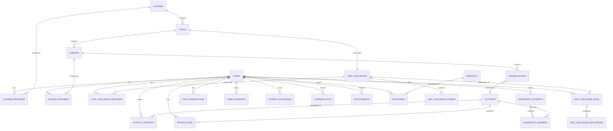

# Data model — MVP

This document is the source of truth for the **conceptual data model** of the La Teacher Alma MVP. It is intended for product/technical planning and for future implementation with PostgreSQL.

It deliberately models the **domain**, not individual screens. UI states such as `Home.ACTIVE`, `Result.PERFECT` or a paywall variant should generally be derived from the domain data described here rather than persisted as screen-specific state.

## Core relationships


```mermaid
erDiagram
    USERS ||--o{ COURSE_PROGRESS : has
    USERS ||--o{ LESSON_PROGRESS : has
    USERS ||--o{ UNIT_CHALLENGE_PROGRESS : has
    USERS ||--o{ UNIT_CHALLENGE_RUNS : starts
    USERS ||--o{ ACTIVITY_ATTEMPTS : makes
    USERS ||--o{ REVIEW_ITEMS : has
    USERS ||--o{ DIAGNOSTIC_ATTEMPTS : takes
    USERS ||--o{ COIN_TRANSACTIONS : has
    USERS ||--o{ USER_INVENTORY : owns
    USERS ||--o{ STREAK_CHALLENGES : starts
    USERS ||--o{ LEARNING_DAYS : records
    USERS ||--o{ ENTITLEMENTS : receives
    USERS ||--o{ PURCHASES : makes

    COURSES ||--o{ TOPICS : contains
    TOPICS ||--o{ LESSONS : contains
    TOPICS ||--|| UNIT_CHALLENGES : ends_with
    UNIT_CHALLENGES ||--|{ UNIT_CHALLENGE_PHASES : contains
    UNIT_CHALLENGES ||--o{ UNIT_CHALLENGE_RUNS : attempted_as
    UNIT_CHALLENGE_RUNS ||--|{ UNIT_CHALLENGE_RUN_PHASES : snapshots
    UNIT_CHALLENGES ||--o{ UNIT_CHALLENGE_PROGRESS : tracked_by
    LESSONS ||--o{ LESSON_BLOCKS : contains
    LESSON_BLOCKS }o--o| ACTIVITIES : references

    COURSES ||--o{ COURSE_PROGRESS : tracked_by
    LESSONS ||--o{ LESSON_PROGRESS : tracked_by

    ACTIVITIES ||--o{ ACTIVITY_ATTEMPTS : attempted_as
    ACTIVITIES ||--o{ REVIEW_ITEMS : reinforces

    DIAGNOSTIC_ATTEMPTS ||--o{ DIAGNOSTIC_ANSWERS : contains
    ACTIVITIES ||--o{ DIAGNOSTIC_ANSWERS : answers

    PRODUCTS ||--o{ PURCHASES : purchased_as
```

Important correction versus the early visual sketch: `course_progress` and `lesson_progress` are **not** modeled as a direct many-to-many relationship. They are independently associated with the user and their respective course/lesson.

## Users

### `users`

Represents the application account/profile identity.

Conceptual fields:

- `id`
- `email`
- `display_name`
- `avatar_url` (optional/future)
- `created_at`
- `updated_at`

Do **not** use `users.is_premium`, `users.current_course` or `users.home_state` as the primary source of truth. Premium/access, active learning and Home state should be derived from related records.

## Educational content

### `courses`

Represents a complete English course/level.

Conceptual fields:

- `id`
- `title`
- `slug`
- `level` (`A1`, `A2`, `B1`, etc.)
- `description`
- `cover_url`
- `status` (`DRAFT`, `PUBLISHED`, `COMING_SOON`)
- `position`
- timestamps

A course may contain both free and paid lessons. Do not collapse course publication/progress state with commercial access.

### `topics`

Logical grouping inside a course.

Conceptual fields:

- `id`
- `course_id`
- `title`
- `description` (optional)
- `position`
- timestamps

Relationship: `Course 1 -> N Topic`.

### `lessons`

Learning unit inside a topic.

Conceptual fields:

- `id`
- `topic_id`
- `title`
- `description` (optional)
- `position`
- `is_required`
- `access_type` (`FREE`, `PAID`)
- `status`
- timestamps

`PAID` means the learner requires valid access, not necessarily a subscription. A paid lesson can be unlocked either by an active membership or by permanent ownership of its course.


### `unit_challenges`

Special assessment milestone that closes a Topic for learning progression.

Each Topic exposed to learners through published/available course content has exactly one Unit Challenge in v1. Draft/import content may be incomplete while being prepared, but content validation should not expose a Topic without its challenge. This does not require adding a separate publication-status field to `topics`.

Conceptual fields:

- `id`
- `topic_id` (unique)
- `title`
- `description` (optional)
- `passing_score` (nullable integer percentage)
- `access_type` (`FREE`, `PAID`)
- `status` (`DRAFT`, `PUBLISHED`)
- timestamps

`passing_score = null` means that completing a valid run is sufficient to pass the challenge. A configured threshold means that a completed run can exist without yet passing the Topic milestone.

Commercial access remains independent from progression. `PAID` uses the same entitlement layer as paid learning content; it must not mean subscription-only.

Relationship: `Topic 1 -> 1 UnitChallenge` for published learner-facing content.

### `unit_challenge_phases`

Ordered authored phase definitions inside a Unit Challenge.

Conceptual fields:

- `id`
- `unit_challenge_id`
- `type` (`CONVERSATION`, `CROSSWORD`)
- `position`
- `config` (`JSONB`)
- timestamps

The relational row owns stable identity/order; `config JSONB` contains mechanic-specific content because the two phase types have different shapes and future challenge mechanics should not require a new relational table per presentation type.

For v1:

- `CONVERSATION` config contains the scene/participants/ordered steps, including private correctness metadata for evaluable Choice steps.
- `CROSSWORD` config contains grid dimensions and deterministic entries with clue, canonical answer, direction and starting coordinates.

Private answer/correctness configuration is storage/domain data and must be stripped from learner-facing read contracts.

A generic learner-facing `ACTIVITY` phase is intentionally not part of Unit Challenge v1, even though lower-level validation/UI primitives may be reused internally.

### `lesson_blocks`

Ordered reusable content units inside a lesson.

Conceptual fields:

- `id`
- `lesson_id`
- `type`
- `position`
- `required`
- `content` (`JSONB`)
- `activity_id` (nullable; used when `type = ACTIVITY`)
- timestamps

Initial block types:

- `TEXT`
- `VIDEO`
- `IMAGE`
- `EXAMPLE`
- `ACTIVITY`
- `SUMMARY`

`JSONB` is appropriate for type-specific block configuration so the MVP does not need one relational table for every content-block subtype.

## Activities and attempts

### `activities`

Reusable exercise definition.

Conceptual fields:

- `id`
- `type`
- `prompt`
- `config` (`JSONB`)
- `explanation` (optional)
- timestamps

Initial types:

- `MULTIPLE_CHOICE`
- `FILL_BLANK_OPTIONS`
- `FILL_BLANK_TEXT`
- `MATCH_WORD_IMAGE`

The configuration can contain choices, accepted answers, matching pairs and other type-specific data.

### `activity_attempts`

Stores a learner submission regardless of where the activity was presented.

Conceptual fields:

- `id`
- `user_id`
- `activity_id`
- `lesson_id` (nullable)
- `context`
- `answer_data` (`JSONB`)
- `is_correct`
- `run_id` (nullable outside normal lessons)
- `attempt_number` (scoped to run + activity)
- `created_at`

Useful contexts:

- `LESSON`
- `REVIEW`
- `ASSESSMENT`
- `DIAGNOSTIC`

This allows the same activity engine to be reused across learning flows.


## Unit Challenge runs and submissions

### `unit_challenge_runs`

Durable attempt/session for one learner traversing one Unit Challenge.

Conceptual fields:

- `id`
- `user_id`
- `unit_challenge_id`
- `request_key` / equivalent start-idempotency key
- `status` (`ACTIVE`, `COMPLETED`, `ABANDONED`)
- `current_phase_position` or equivalent current-phase pointer
- `passing_score_snapshot` (nullable)
- `correct_items` (nullable until completion)
- `total_items` (nullable until completion)
- normalized score/percentage is derived from `correct_items / total_items` rather than stored independently
- `passed` (nullable until completion; frozen result for this run)
- `started_at`
- `updated_at`
- `completed_at` (nullable)
- `abandoned_at` (nullable)

A run is resumable while `ACTIVE`. Explicit learner exit marks it `ABANDONED`; accidental interruption does not. Resume is guaranteed at the last submitted phase boundary; unsent local interaction state inside the current phase is not durable in v1.

`passing_score_snapshot` and the persisted `passed` result prevent later content/configuration changes from rewriting historical meaning.

Each replay creates a new run. Earlier runs are never overwritten by a later score.

Commercial access is checked at run start. Access is then frozen for that active run; a new run/replay revalidates current access.

### `unit_challenge_run_phases`

Per-run ordered snapshot and submission boundary for challenge phases.

Conceptual fields:

- `id`
- `run_id`
- `source_phase_id` (reference to authored phase)
- `position`
- `type` (`CONVERSATION`, `CROSSWORD`)
- `content_snapshot` (`JSONB`)
- `answer_data` (`JSONB`, nullable until submission)
- `correct_items` (nullable until submission)
- `total_items`
- `submission_request_key` or equivalent idempotency boundary (nullable before submission)
- `submission_response` (JSONB public response receipt for exact transport retries, written atomically with submission)
- `submitted_at` (nullable)
- timestamps as needed

The run-phase snapshot is authoritative for the already-started run. Later edits to `unit_challenge_phases.config` must not alter an active or historical run.

A submitted run phase is immutable for that run. There is no same-run retry.

`answer_data` stores the learner's submitted answers in the shape required by the phase type. Unanswered evaluable items are represented deterministically and score as incorrect.

Scoring remains item-based:
- each Conversation Choice = one evaluable item;
- each Crossword answer word = one evaluable item;
- v1 has no weighting.

A separate row per individual crossword cell or conversation choice is not required for v1 because those items do not have independent lifecycle/query needs. Their authored definition and submitted answers can remain inside the phase snapshot/answer JSONB while aggregate phase scoring is relationally visible.

Do not route Unit Challenge v1 answers through `activity_attempts`. That table remains appropriate for reusable Activity definitions, but Unit Challenge v1 deliberately uses challenge-specific `CONVERSATION` and `CROSSWORD` mechanics and does not create Review state.

## Learning progress

### `course_progress`

Created when a user starts a course.

Conceptual fields:

- `id`
- `user_id`
- `course_id`
- `status` (`IN_PROGRESS`, `COMPLETED`)
- `started_at`
- `completed_at` (nullable)
- `updated_at`

Absence of a row can represent `NOT_STARTED`.

### `lesson_progress`

Tracks consolidated completion for a lesson.

Conceptual fields:

- `id`
- `user_id`
- `lesson_id`
- `status` (`COMPLETED`)
- `completed_run_id` (nullable for seeded completion)
- `started_at`
- `completed_at` (nullable)
- `updated_at`

Absence means no completed lesson. Temporary traversal belongs to LessonRun; the completed run holds its first-attempt score snapshot.

### `unit_challenge_progress`

Consolidated durable indication that a learner has passed a Unit Challenge for progression.

Conceptual fields:

- `id`
- `user_id`
- `unit_challenge_id`
- `passed_run_id`
- `completed_at`
- `updated_at`

Absence means the Unit Challenge has not yet been passed for progression.

A row is created only by a qualifying `COMPLETED` run:
- any completed run when `passing_score_snapshot = null`;
- otherwise a completed run whose score meets/exceeds that snapshot.

The first qualifying run establishes progression completion. Later replays may improve or worsen score history but never remove this progress row or relock later content.

Topic completion is derived from its Unit Challenge progress rather than stored as a screen-specific Topic status.

Course completion must account for required Topic Unit Challenges; it must not be inferred solely from required Lesson completion once Unit Challenge v1 is active.

Course/Roadmap percentage is derived presentation data rather than a stored percentage. The API contract must define its denominator consistently so a learner cannot be shown as 100% complete while a required Unit Challenge is still unpassed.


## Review

### `review_items`

Represents an activity/concept that should be reinforced after an incorrect attempt.

Conceptual fields:

- `id`
- `user_id`
- `activity_id`
- `source_lesson_id`
- `status` (`ACTIVE`, `RESOLVED`)
- `incorrect_attempts`
- `last_reviewed_at` (nullable)
- `resolved_at` (nullable)
- timestamps

For the MVP, a correct review can mark an item `RESOLVED`. The structure can later evolve toward spaced repetition without replacing the activity engine.

## Diagnostic

### `diagnostic_attempts`

Represents one placement-test session.

Conceptual fields:

- `id`
- `user_id`
- `started_at`
- `completed_at` (nullable)
- `status`
- `internal_score` (optional/internal)
- `recommended_level`
- `recommended_course_id` (nullable)
- optional qualitative result data, if persistence becomes useful

A separate `diagnostic_results` table is not required for the MVP unless implementation later shows a clear need.

### `diagnostic_answers`

Conceptual fields:

- `id`
- `diagnostic_attempt_id`
- `activity_id` **(FK to `activities`, not a PK)**
- `answer_data` (`JSONB`)
- `is_correct`
- `created_at`

The learner-facing result remains qualitative: estimated level, strengths, reinforcement areas and recommended course. It is not a formal CEFR certification.

## Streak and learning activity

### `learning_days`

Stores valid learning days instead of relying only on a mutable streak integer.

Conceptual fields:

- `id`
- `user_id`
- `activity_date`
- `created_at`

From this history the system can derive current streak, longest streak and weekly consistency. A cached streak value may be introduced later only if needed for performance.

## Coins and store

### `coin_transactions`

Ledger of all coin movements.

Conceptual fields:

- `id`
- `user_id`
- `amount` (positive or negative)
- `type`
- `reason`
- `reference_type` (optional)
- `reference_id` (optional)
- `created_at`

Examples:

- lesson reward: `+N`
- optional perfect-performance bonus: `+N`
- streak challenge reward: `+N`
- streak-shield purchase: `-N`

The balance can initially be derived from `SUM(amount)`; a cached balance can be added later if necessary.

Exact coin values and economy are intentionally not fixed yet.

### `user_inventory`

Stores consumable owned items.

Conceptual fields:

- `id`
- `user_id`
- `item_type`
- `quantity`
- `updated_at`

Initial MVP item:

- `STREAK_SHIELD`

The shield has a configurable inventory limit and is consumed automatically when the product rules determine that a missed day is eligible for protection.

### `streak_challenges`

Represents the optional 7-day habit challenge.

Conceptual fields:

- `id`
- `user_id`
- `status` (`ACTIVE`, `COMPLETED`, `FAILED`)
- `started_at`
- `ends_at`
- `entry_cost`
- `reward_amount`
- `completed_at` (nullable)
- `created_at`

Persist the challenge's actual `entry_cost` and `reward_amount` so later economy changes do not alter an already-started challenge.

Only one active challenge per user is the provisional MVP rule.

## Commercial model and access

The MVP commercial direction is:

- free content within each available course where practical;
- Premium subscription for access to paid content while active;
- permanent purchase of an individual course;
- no individual lesson sales in the MVP.

### `products`

Represents a commercial product offered by the stores/provider.

Conceptual fields:

- `id`
- `type` (`SUBSCRIPTION`, `COURSE_PURCHASE`)
- `name`
- `description`
- `course_id` (nullable; required for course purchase products)
- provider/store product identifiers as needed
- `status`
- timestamps

Price should not be assumed to be a permanent business constant in application code. Actual storefront pricing is ultimately provider/store controlled; locally stored/display metadata may be used as appropriate during implementation.

### `purchases`

Audit/reference record for a completed or relevant commercial transaction.

Conceptual fields:

- `id`
- `user_id`
- `product_id`
- `status`
- `amount` / `currency` when useful for records
- `external_reference`
- timestamps

Store/provider validation remains authoritative for mobile digital purchases.

### `entitlements`

Represents the access a user currently owns/is entitled to use.

Conceptual fields:

- `id`
- `user_id`
- `type`
- `resource_type` (nullable)
- `resource_id` (nullable)
- `source`
- `starts_at`
- `expires_at` (nullable)
- `status`
- `external_reference` (optional)
- timestamps

Examples:

- active subscription -> global/all-course access until expiration;
- permanent A2 course purchase -> access to that course with no expiration.

Conceptual access check for a paid lesson:

```text
if lesson.access_type == FREE:
    allow
else if user has valid entitlement for lesson's course:
    allow
else if user has valid global Premium entitlement:
    allow
else:
    deny as commercial-access locked
```

`purchases` and provider subscription events create/update validated `entitlements`. The exact provider synchronization strategy will be defined with the payments implementation/API contract.

## Important modeling principles

- Learning progression and commercial access are separate concerns.
- Completion and correctness are separate concerns.
- Do not persist screen-specific derived states unless there is a real domain reason.
- Reuse lower-level activity/presentation primitives where appropriate, but do not force Unit Challenge v1 mechanics into `activities` when they have their own phase/session semantics.
- Use relational structure for stable domain relationships and lifecycle/query boundaries; use `JSONB` where challenge/content shape is genuinely mechanic-specific or snapshot-oriented.
- Keep provider-specific payment details behind the payments/access module where possible.
- This is a **conceptual MVP model**. PostgreSQL types, indexes, unique constraints, cascade behavior and exact foreign-key rules belong to the next logical-schema step.

## Deferred / not modeled yet

Not required in the initial data model unless scope changes:

- rankings/social features;
- challenge mechanics beyond v1 `CONVERSATION` and `CROSSWORD` (for example Sentence Builder, Listening Challenge or unrelated minigames);
- advanced cosmetics/customization;
- complex achievements catalog;
- AI-generated-content history;
- full admin/CMS model;
- advanced spaced-repetition scheduling;
- detailed analytics/event warehouse;
- push-notification delivery records.


## Rich lesson content evolution

The richer lesson-content contract required for high-fidelity mobile rendering does not currently require new relational entities.

Existing flexible fields remain the preferred storage boundary:

- `lesson_blocks.content JSONB` for TEXT segments, EXAMPLE variants/dialogue turns, VIDEO metadata and SUMMARY structure.
- `activities.config JSONB` for public activity presentation context plus private type-specific validation configuration.

This preserves the stable Course -> Topic -> Lesson -> LessonBlock model while allowing structured dialogue, optional audio metadata, contextual images and richer summaries.

Provider-specific audio generation/storage should remain outside the core domain model. Content should reference playable media through URLs/metadata rather than embedding provider behavior in lessons.

A future migration should only be introduced if actual querying, indexing, ownership or lifecycle requirements make a dedicated relational media/content entity necessary.


## LessonRun session model

Implemented by migration `20260925000000_lesson_runs`.

- `LessonRun`: UUID id, userId, lessonId, requestKey, ACTIVE/COMPLETED/ABANDONED, nullable currentBlockId, startedAt/updatedAt/completedAt/abandonedAt, nullable correctAnswers/totalActivities snapshot.
- `LessonRunBlockProgress`: composite (runId, lessonBlockId), completedAt. Required traversal is checked against these rows, never durable history.
- Normal attempts carry runId; (runId, activityId, attemptNumber) is unique. First submission within the accepted run determines score.
- The final required pedagogical mutation automatically completes the run and creates durable LessonProgress (completedRunId) and LessonBlockProgress. Every wrong submission in that run increments Review once; correct retries do not erase errors. Repeated complete has no duplicate effects.
- Abandoned data remains isolated from durable learning. Replay creates no run or attempts.

## Review v1 model clarifications

`docs/review-semantics-v1.md` is the accepted lifecycle source of truth.

- `review_items` represents one lifecycle per `(user_id, activity_id)`, not one row per mistake episode. Review implementation should enforce that pair as unique.
- A RESOLVED item can reactivate after a later qualifying error from a completed normal LessonRun; `resolved_at` is then cleared.
- `incorrect_attempts` is historical difficulty/error data, not a pending-item multiplicity.
- Review answers use `activity_attempts.context = REVIEW`, set `review_item_id`, normally retain `source_lesson_id` in `lesson_id`, and have no LessonRun.
- Review v1 intentionally adds no persisted `review_sessions` or `review_session_items` entity. The active batch is ephemeral and represented to Mobile by an opaque short-lived batch authorization token.
- Review submissions require durable idempotency. The implementation may add the smallest request-key field/constraint necessary to ActivityAttempt or an equivalent persistence boundary; do not model a full session solely for this purpose.


## Unit Challenge v1 model clarifications

`docs/unit-challenge-semantics-v1.md` is the accepted lifecycle/product source of truth.

- Published learner-facing Topic -> UnitChallenge cardinality is one-to-one.
- Unit Challenge phase identity/order is relational; mechanic-specific authored content remains in `unit_challenge_phases.config JSONB`.
- Durable runs are required because the experience spans multiple phases, must survive accidental interruption and must preserve historical meaning across content edits.
- Per-run phase snapshots/submissions use `unit_challenge_run_phases`; do not create one relational row per crossword cell or conversation choice unless future query/lifecycle requirements justify it.
- `unit_challenge_progress` represents consolidated progression completion and is independent from run history. A later replay never revokes it.
- Unit Challenge v1 does not create `ActivityAttempt` or `ReviewItem` rows.
- Correct answers/canonical crossword solutions remain private server-side content and are never part of learner-facing GET payloads.
- A dedicated admin/CMS remains out of MVP scope. Seed/import validation should operate on the same conceptual content model without introducing authoring entities merely for UI convenience.
